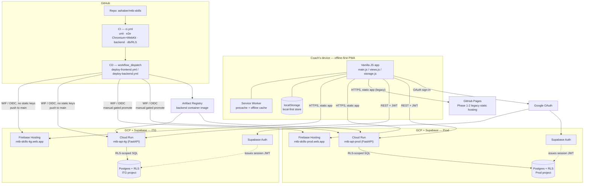
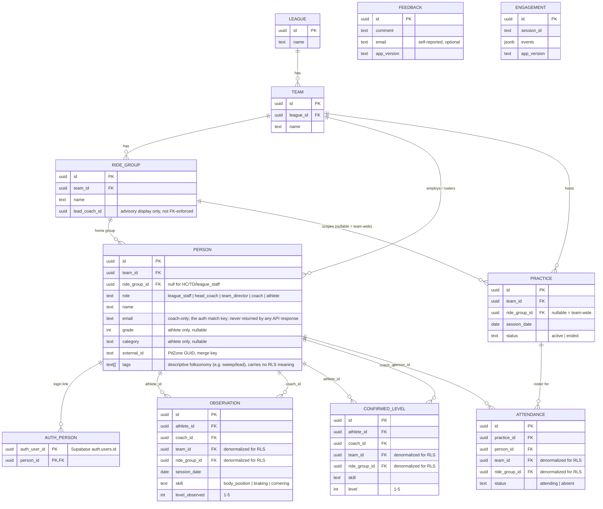

# System Architecture

## System landscape

Two fully isolated environments (separate Supabase projects, separate
Cloud Run services, separate Firebase Hosting targets) so ITG can be broken
on purpose without any risk to real coach data — the same promotion
discipline described in `docs/architecture/SECURITY.md`'s deploy-pipeline
section. See `README.md`'s "Deployment" section for the live URLs and
deploy commands.

## Infrastructure as code

- The Postgres schema, indexes, and every RLS policy live as numbered,
  idempotent SQL migrations in `supabase/migrations/` — the schema's
  source of truth is version-controlled and re-derivable from scratch, not
  click-ops in a Supabase dashboard.
- Idempotency isn't a suggestion — the CI `db` job actually re-applies
  every migration a second time and fails the build on any error.
- GCP resource bindings (WIF pool/provider, IAM roles) are provisioned by
  an idempotent shell script (`scripts/setup-wif.sh`), not manual console
  clicks — safe to re-run, existence-checked at every step.
- `scripts/ops_check.sh` gives a one-shot read of both environments'
  health, DB reachability, and deployed-commit drift against `main` — see
  root `README.md`.

## Database schema (ERD)

Two intentional design choices worth calling out:

- **Denormalized `team_id`/`ride_group_id` on `observation`, `confirmed_level`,
  `practice`, and `attendance`** — each row carries its own scope columns
  instead of requiring a join back through `person`/`practice` at query
  time, so every RLS policy filters on an indexed column directly. A
  conscious performance/normalization tradeoff, not an oversight.
- **`feedback` and `engagement` are deliberately disconnected from the
  tenant graph** — no foreign keys to `person`/`team`, RLS enabled with
  *zero* policies (default-deny for every role). They're intentionally
  unreachable from the coach-facing API, because both are anonymous
  submissions with no persona to scope them to.

## Offline-first architecture

Practices happen on trails with no cell service, so this isn't a
progressive-enhancement afterthought:

- Service worker pre-caches the full app shell and rubric content at
  install time — zero network calls needed to open the app after first
  install.
- `src/storage.js` is a swappable storage abstraction (`local` | `db`) —
  the entire app was built and used fully offline-only for Phases 1–2, and
  the Phase 3 sync layer was added *underneath* that same interface
  without changing any view code.
- Sync/merge strategy is explicit and conflict-safe: observations are
  append-only (unioned by ID, never overwritten), confirmed skill levels
  are last-write-wins, and a coach's local data is never deleted by a
  failed or partial sync — rollback is always "flip the storage flag back."

## Tech stack

| | |
|---|---|
| Frontend | Vanilla JS (ES modules), Vite, `vite-plugin-pwa` |
| Backend | Python 3.12, FastAPI |
| Database | PostgreSQL via Supabase (managed), Row-Level Security |
| Auth | Supabase Auth, Google OAuth, JWT |
| Infra | GCP Cloud Run, Artifact Registry, Firebase Hosting, Workload Identity Federation |
| CI/CD | GitHub Actions |
| Testing | Vitest, Playwright (Python), pytest, pytest-cov |

Current test counts and coverage change often enough that hardcoding them
here would go stale — see the CI workflow (`unit`/`e2e`/`backend`/`db`
jobs) for the current pass/fail state on any given commit.
